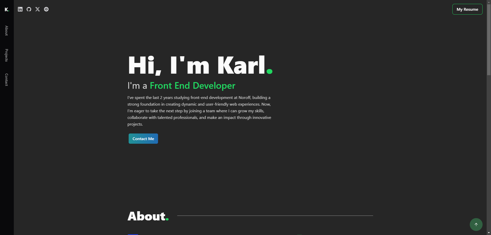

###### Karl Petter Nordgaard Portfolio

### Introduction
Welcome to my personal portfolio website, showcasing my skills, projects, and experience as a front-end developer. Explore my projects, learn about my journey, and feel free to get in touch.

### Screenshot



### Features
- Fully responsive design.
- Interactive project showcase.
- About section with an overview of skills and interests.
- Contact section for easy communication.

### Technologies Used
- React
- TypeScript
- Tailwind CSS
- Framer Motion
- Vite

[](https://skillicons.dev)

### Setup and Installation
```bash
git clone https://github.com/yourusername/portfolio.git
cd portfolio
npm install
npm run dev
```

### Live Demo
https://karlpnordportfolio.netlify.app/

### Contact
- Email: nordgaardkarlpetter@gmail.com
- LinkedIn: https://www.linkedin.com/in/karl-petter-n-560624137/
